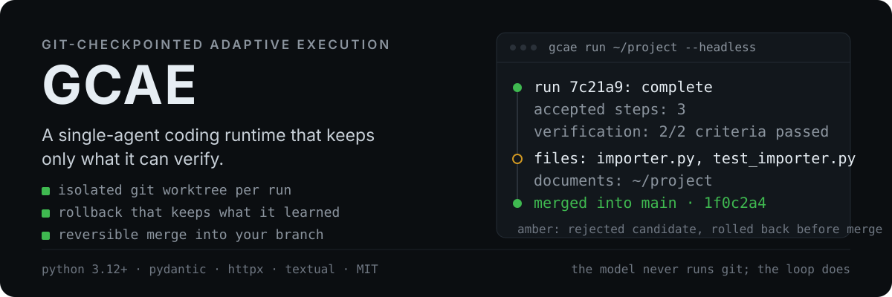
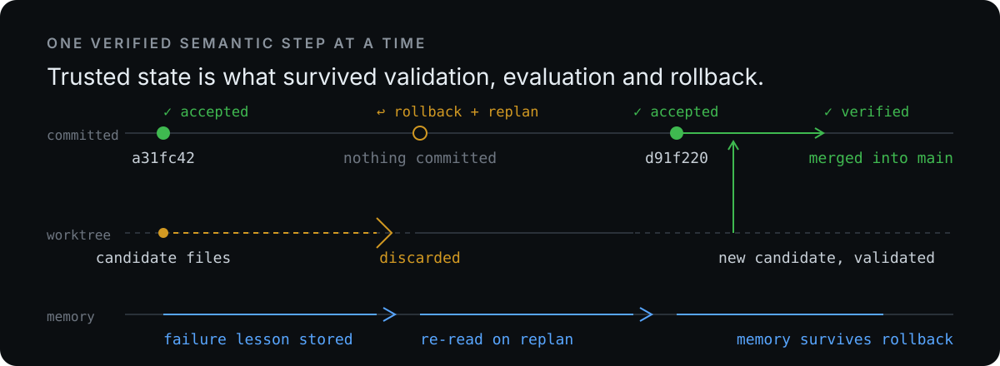

<p align="center">
  
</p>

<p align="center">
  <a href="https://github.com/mberkanbicer/gcae/actions/workflows/ci.yml"></a>
  
  
  
  <a href="./LICENSE"></a>
</p>

<p align="center">
  <b>Git-Checkpointed Adaptive Execution</b> — an agent runtime that works in an isolated Git
  worktree, commits only what deterministic validation and evaluation accept, rolls back the rest,
  and keeps the failure knowledge that the rollback would otherwise destroy.
</p>

---

## What it is

GCAE runs one coding task at a time against a Git repository. The agent plans the task as
**semantic steps**, executes tools inside a dedicated worktree, validates each step with
deterministic checks, asks a model whether the step actually advanced the objective, and then
either **checkpoints** the step as a commit or **rolls it back** and replans. A final verification
gate checks every success criterion before the run is declared complete. The verified branch is then
merged into your checkout — and that merge is reversible.

It ships as a CLI plus a full-screen terminal dashboard. The engine has no dependency on the TUI and
runs headless in CI.

## What a finished run looks like

```console
$ gcae run ~/csv-parser "fix quoted records across chunk boundaries" --headless
...
run d1ae6b3af14d: complete
accepted steps: 1, commit: d176e5f2effb87af4108bafb4ea0b5d699fecc59
verification: 1/1 criteria passed
worktree: ~/.local/state/gcae/worktrees/d1ae6b3af14d
branch: gcae/d1ae6b3af14d merged into main (undo: gcae undo ~/csv-parser d1ae6b3af14d)
files: parser.py
documents: ~/csv-parser (in your working tree now)
```

Every line above is production output, not a mock: the run merged its branch, removed its own
worktree, and named the folder holding the file. `gcae undo` puts the branch back.

A step that fails validation or evaluation never reaches your branch:

```console
$ gcae run ~/project "rework the parser" --headless
WARNING gcae: rollback to 81aac02
...
run 3f81c2d4: failed: step budget exhausted after 8 iterations (raise [runtime] max_steps ...)
files: (no file changes)
documents: none — the run produced no files
```

## Why it is different

| Property | How GCAE does it |
| --- | --- |
| Trusted state is explicit | Only an accepted evaluation creates a commit. `accepted_commit` is always a verified tree. |
| Failure is cheap | Rejection runs `reset --hard` plus cleanup **inside the worktree only**; your repository is untouched. |
| Rollback is not amnesia | Facts, decisions and failure lessons live in SQLite and survive every rollback, so the replanned step starts smarter. |
| Work is verified, not assumed | Deterministic criteria (`file exists:`, `file contains:`, `file contains exactly:`, `command succeeds:`) run first; a model judge is opt-in and fails closed. |
| Every git operation is the loop's job | Base commit, commit identity, run branch, worktree, merge, conflict resolution and cleanup are automatic. The model is never allowed to run `git`. |
| Your working tree is never the workshop | The agent edits an isolated worktree under the state directory, one worktree per run. |
| A slow model is never a frozen screen | Model calls stream and report progress: elapsed time, first-token latency, content and reasoning character counts, plus a heartbeat every 10s while the model deliberates. A call that produces nothing for `stall_timeout` fails honestly instead of hanging the run. |
| Self-recovery is the default | Every failure that could end a run — stagnation, unusable model output, a stall, an exhausted budget, a planner outage, a transient network error, even an unexpected exception — is diagnosed from the run's own trace before it is allowed to stop anything. Bounded, and never a substitute for evidence. |
| A broken model is recovered too | A dead or misconfigured model is the one failure self-diagnosis cannot fix, so the role moves to `[models.escalation]` instead: a provider outage, or the same rejection three times, switches the controller for the rest of the run. Transient errors (429, 5xx, timeouts) are retried with backoff first. Verified live: an invalid controller model id still finished the task in 11 seconds. |
| One run per repository | `run`, `resume`, `merge` and `undo` take a per-repository lock, so two runs can never interleave two merges into the same branch. The lock lives in the state directory and dies with the process. |
| A blocked run fixes itself first | Before asking you, a failing run (stagnation, unusable model output, exhausted budget) reads its own trace — events, validation evidence, failure memories — and diagnoses the root cause, then retries with the correction. Bounded, and always outranked by the verification gate. |

## The execution loop

<p align="center">
  
</p>

```
PLAN → SEMANTIC STEP → EXECUTE → OBSERVE → VALIDATE → EVALUATE → ACCEPT | ROLLBACK | REPLAN → VERIFY
```

- **PLAN** — a model-backed planner derives the objective, the success criteria, the constraints and
  an ordered step list from your request (or a deterministic planner writes a single step when you
  prefer that).
- **SEMANTIC STEP** — tools run freely *inside* a step; the unit of progress is a verified step, not
  a tool call. A per-step tool budget and a repetition guard keep a confused model bounded.
- **VALIDATE** — deterministic checks: configured commands, `git diff --check`, scope violations,
  dependency-manifest changes, workspace hygiene.
- **EVALUATE** — a structured decision (`accept`, `rollback`, `replan`, `continue`,
  `finish_candidate`) with a reason, a progress score and memories to promote.
- **ACCEPT** — checkpoint commit `gcae: <goal>`, working memory settled into durable memory.
- **ROLLBACK** — the candidate is discarded, the lesson is stored as immutable memory, the step is
  replaced by a replanned one.
- **VERIFY** — every success criterion is checked again on the final tree before the run may
  complete.
- **RECOVER** — if the run is about to give up (stagnation, unusable provider output, exhausted
  budget, or an unexpected exception), the recovery advisor reads the run's own trace and returns a `Diagnosis`: root cause,
  one corrective instruction, and a strategy. `replan` queues the correction as the next step and
  grants bounded extra iterations; `ask_user` and `stop` end the run honestly.

## Install

Requires Python 3.12+ and Git. The package is not on PyPI yet; install from the repository:

```bash
git clone https://github.com/mberkanbicer/gcae.git
cd gcae
python -m venv .venv
.venv/bin/python -m pip install -e ".[dev]"     # runtime + test/lint tooling
.venv/bin/gcae --version
```

## First run

```bash
cp config.example.toml config.toml      # config.toml is gitignored, it holds your API key
```

Point it at a local Ollama endpoint (no key needed) or an OpenAI-compatible provider:

```toml
[provider]
kind = "http"                                  # or "openrouter"
base_url = "http://localhost:11434/v1"         # local models need no API key
model = "qwen2.5-coder:14b"

[validation]
commands = ["pytest -q"]                       # deterministic evidence for every step
```

```bash
# interactive dashboard: it asks for the task and the planner derives the criteria
gcae run ~/src/project --config config.toml

# or fully specified
gcae run ~/src/project "add a --dry-run flag to the importer" \
  --criterion "command succeeds: pytest -q" \
  --config config.toml

# non-interactive: state JSON on stdout, log on stderr
gcae run ~/src/project "add a --dry-run flag" --headless --config config.toml
```

The repository does not need to be pristine: GCAE creates the base commit it needs, commits your
pending edits as that base (never discarding them), and uses `GCAE <gcae@localhost>` when no Git
identity is configured.

## The dashboard

```
GCAE │ RUNNING │ parser-project │ 7c21a9 │ openrouter · qwen3-14b · ACT │ 12m43s
───────────────────────────────────────────────────────────────────────────────────────
OBJECTIVE  fix quoted records across chunk boundaries   ACTIVE       pytest -q tests/
PLAN       3/5 steps  ✓ inspect  ✓ reproduce  ● fix     CHECKPOINT   trusted a31fc42
NOW        carry quote state across the boundary        VALIDATION   ✓ diff-check  … pytest
CTX ██████░░░░ 9.8k/32k   MEM 18 facts · 6 decisions   ITER 12
EVENTS  20:31:04 ✓ checkpoint a31fc42 · 20:30:57 ↻ replan · 20:29:29 ↩ rollback
[p] Pause  [s] Stop  [d] Diff  [l] Logs  [m] Memory  [c] Context  [i] Instruct  [?] Help  [q] Quit
```

| Key | Action | Key | Action |
| --- | --- | --- | --- |
| `p` / `r` | pause / resume | `d` | candidate diff, per file |
| `s` | stop (asks first) | `l` | full event log with filters |
| `i` | inject an instruction / new task | `m` | memory inspector with provenance |
| `Enter` | open the focused panel's detail | `c` | context inspector (what the model sees) |
| `M` | merge accepted work | `e` / `t` | evaluation / plan detail |

The dashboard renders at any terminal width from 160 columns down to 80, stays responsive while
models and tools run, and never blocks on Git, SQLite or the provider.

## CLI

| Command | Purpose |
| --- | --- |
| `gcae run <repo> [request]` | start a run (`--criterion`, `--constraint`, `--merge/--no-merge`, `--no-auto-bootstrap`, `--tui/--headless`) |
| `gcae resume <repo> <run-id>` | continue a stopped or failed run from its persisted state |
| `gcae list` | runs with status, accepted steps and merge state |
| `gcae inspect <run-id>` | objective, plan, verification, merge state (`--json` for the raw state) |
| `gcae merge <repo> <run-id>` | merge a run branch later, resolving conflicts through the agent |
| `gcae undo <repo> <run-id>` | reverse a recorded merge |

Exit codes: `0` only when a run completed **and** its work reached your checkout; `1` for handled
errors, failed runs, or a merge that did not happen; `2` for usage errors.

## Configuration essentials

| Key | Default | Effect |
| --- | --- | --- |
| `provider.context_limit` | `8192` | token budget for the reconstructed context |
| `provider.json_mode` | `true` | send `response_format=json_object`; disable for reasoning models |
| `provider.generation.max_tokens` | – | output budget; raise it when a planner schema is truncated |
| `validation.commands` | `[]` | deterministic commands run at every evaluation |
| `runtime.max_steps` | `20` | iterations before a run gives up |
| `runtime.auto_bootstrap` | `true` | create the base commit a run needs |
| `runtime.auto_merge` | `true` | merge the verified branch on completion |
| `runtime.merge_accepted_on_failure` | `true` | hand over checkpoints a failed run accepted (labelled unverified) |
| `runtime.resolve_merge_conflicts` | `true` | resolve merge conflicts through the agent |
| `runtime.cleanup_after_merge` | `true` | remove GCAE's worktree once merged |

See [`config.example.toml`](./config.example.toml) and
[`docs/CONFIGURATION.md`](./docs/CONFIGURATION.md).

## What GCAE does not do

- **It is not a sandbox.** `run_command` enforces a blocklist and workspace confinement, not
  OS-level isolation. Run it against repositories you can restore.
- **It is not a multi-agent framework.** One agent, one run, no orchestration graph.
- **It does not decide product questions for you.** When the task is ambiguous the agent asks, and
  `ask_user` pauses the run rather than guessing.
- **It cannot verify what you never specified.** Without criteria it can only check what the
  planner inferred; pass `--criterion` for the things that matter.
- **Token figures are estimates** (`chars / 4`), labelled `(est)` everywhere they appear.
- **Parallel runs in one repository are unsupported**; each run owns one worktree and there is no
  cross-run lock.

## Development

```bash
.venv/bin/pytest -q                      # 165 tests
.venv/bin/ruff check .                   # lint
.venv/bin/mypy src/gcae                  # strict typing
.venv/bin/python tools/tui_demo.py       # dashboard with real git operations, no model calls
```

CI (`.github/workflows/ci.yml`) runs the same commands on Python 3.12 and 3.13, builds the sdist and
wheel, installs the wheel in a clean environment, and checks that `gcae --version` works. Tags
matching `v*` publish a GitHub release with the build artifacts.

## Documentation

| Document | Contents |
| --- | --- |
| [`docs/ARCHITECTURE.md`](./docs/ARCHITECTURE.md) | module map, state vs knowledge, data flow |
| [`docs/STATE_MACHINE.md`](./docs/STATE_MACHINE.md) | phases, allowed transitions, failure routing |
| [`docs/GIT_EXECUTION.md`](./docs/GIT_EXECUTION.md) | worktrees, checkpoints, merges, conflicts, bootstrap |
| [`docs/MEMORY_CONTEXT.md`](./docs/MEMORY_CONTEXT.md) | memory kinds, retrieval, context budgeting |
| [`docs/TOOLS.md`](./docs/TOOLS.md) | tool contracts and the command guardrail |
| [`docs/PROVIDERS.md`](./docs/PROVIDERS.md) | OpenAI-compatible providers, reasoning models, structured output |
| [`docs/TUI.md`](./docs/TUI.md) | dashboard layout, keys, screens, responsive behavior |
| [`docs/CLI.md`](./docs/CLI.md) · [`docs/CONFIGURATION.md`](./docs/CONFIGURATION.md) | commands and every setting |
| [`docs/TEST_PLAN.md`](./docs/TEST_PLAN.md) | suites, mandatory end-to-end scenarios, commands |
| [Wiki](https://github.com/mberkanbicer/gcae/wiki) | task-oriented guides built from these documents; sources live in [`wiki/`](./wiki) and publish with `tools/publish_wiki.sh` |
| [`CHANGELOG.md`](./CHANGELOG.md) | released features and fixes |

## License

MIT — see [`LICENSE`](./LICENSE).
